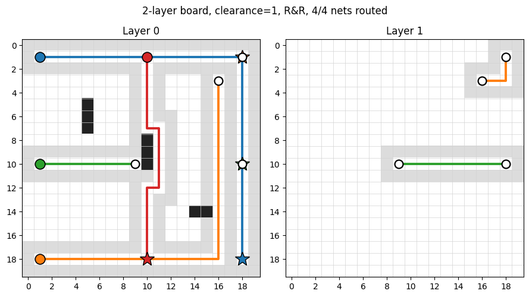

# PCB Autorouter (Multi-Layer A\* + DRC + KiCad I/O + Learned Net Ordering)

[](https://github.com/zafstathis-gif/PCB-Routing-Algorithm/actions/workflows/ci.yml)

[](LICENSE)

A PCB autorouter written from scratch in Python. It routes multi-layer netlists with vias, enforces trace-to-trace clearance, and reads and writes real KiCad `.kicad_pcb` files. It also includes a PyTorch reinforcement-learning track that learns net ordering from random boards, and a CNN-based learned A\* heuristic that cuts the number of search nodes A\* has to expand.

I built this as an ECE portfolio project to explore the algorithmic core of electronic design automation (the same family of problems KiCad's `freerouting` and the commercial autorouters solve) and to see how close a learned policy can get to a strong heuristic baseline on a small, well-defined task.



A 20×20 2-layer board routed with `clearance=1` and rip-up-and-reroute. Black cells are static obstacles, light gray is the per-trace clearance halo, white-outlined circles are vias bridging the two layers. Animated version: [`routing_demo.gif`](routing_demo.gif).

## Features

- **Multi-layer A\* pathfinding** with the Manhattan heuristic. The heuristic stays admissible across layers because it treats the layer-switch (via) cost as 0 in its lower bound. With `clearance=0` the result is always an optimal path. An opt-in `prefer_directions=True` flag turns on the classical even-horizontal / odd-vertical EDA layer bias.
- **Through-hole and SMD pads** via a dedicated `Pad(x, y, layers)` type. Multi-source A\* seeds every layer a pad sits on and accepts any of the goal layers.
- **Configurable trace-to-trace clearance (DRC)** via halo-on-lock dilation. A `static_mask` keeps pads and walls separate from trace halos so shared pins still route under clearance without lifting the real obstacles next to them.
- **Sequential netlist routing** with shared-pin support, five net-ordering heuristics (`manhattan_asc`/`desc`, `bbox_area_asc`/`desc`, user-order), and a `route_board_best_of` wrapper that picks the winning ordering automatically.
- **Rip-up-and-reroute** (`route_board_rrr`): when a net fails, the router finds the routed nets that sit on its ideal path, rips them up, retries the failed net, then re-routes the displaced ones. Includes per-net rip-up caps and an outer iteration limit; halo-aware so it works under non-zero clearance.
- **KiCad I/O**: `kicad_io.py` parses a `.kicad_pcb` file (via `kiutils`), routes every net, and writes `(segment ...)` / `(via ...)` items back to disk. Multi-pad nets are connected with a Manhattan-distance MST over pad positions.
- **CLI**: `pcb-route board.kicad_pcb -o routed.kicad_pcb --clearance 0.2 --rrr` for one-shot routing after `pip install -e .`.
- **Reinforcement learning track**: a three-phase PyTorch pipeline (REINFORCE → PPO+CNN → PPO+CNN+rip-up) for learned net ordering, plus a learned A\* heuristic with a CNN trained on Dijkstra ground truth. Numbers below are what I actually measured, including the cases where the learned approach loses to the heuristic baseline.
- **Visualization**: per-layer subplots, halo shading distinct from static obstacles, via markers bridging layers, faded crosses for unrouted nets.
- **Unit tests**: 86 tests using `unittest` (no third-party test framework needed).

## Project Structure

```
.
├── pcb_grid.py            # PCBGrid: 3D layer stack, static_mask, halo stamping
├── router.py              # Multi-layer A* + sequential routing + R&R + ordering heuristics
├── kicad_io.py            # Read/write .kicad_pcb (load_board, save_routed_board)
├── cli.py                 # `pcb-route input.kicad_pcb -o output.kicad_pcb`
├── app.py                 # Streamlit web demo (random boards + KiCad upload)
├── visualize.py           # Per-layer matplotlib renderer + animate_board GIF helper
├── bench.py               # Benchmark with --layers / --clearance flags
├── pyproject.toml         # Packaging: pip install -e .[rl,web,dev]
├── .github/workflows/
│   └── ci.yml             # Ruff + mypy + pytest on Python 3.9-3.12
├── examples/
│   ├── build_examples.py        # Generates the .kicad_pcb fixtures below
│   ├── blinker_unrouted.kicad_pcb
│   └── two_layer_demo.kicad_pcb
├── rl/
│   ├── env.py                 # Gym-style routing environment (multi-layer aware)
│   ├── policy.py              # PyTorch policy nets + per-net features
│   ├── train.py               # REINFORCE training loop (Phase 1)
│   ├── train_ppo.py           # PPO + CNN (Phase 2)
│   ├── train_ppo_ripup.py     # PPO + CNN + rip-up actions (Phase 3)
│   ├── evaluate.py            # Trained net-ordering policies vs heuristic baselines
│   ├── heuristic_net.py       # CNN cost-to-go function + admissibility clamps (Phase 4)
│   ├── heuristic_data.py      # Dijkstra-from-goal supervised data generator
│   ├── train_heuristic.py     # One-sided Huber loss training for HeuristicNet
│   ├── evaluate_heuristic.py  # Learned A* heuristic vs vanilla Manhattan A*
│   ├── policy.pt              # Trained weights for Phases 1-3
│   ├── policy_ppo.pt
│   ├── policy_ppo_ripup.pt
│   └── heuristic_net.pt       # Trained learned-heuristic weights
├── tests/
│   ├── test_router.py     # Multi-layer / clearance / R&R / custom-heuristic tests
│   ├── test_rl.py         # Env + policy-network shape tests
│   ├── test_heuristic.py  # Dijkstra + HeuristicNet + clamp tests
│   └── test_kicad_io.py   # Round-trip load -> route -> save tests
├── requirements.txt
└── README.md
```

## Quick Start

```bash
# Core install (numpy, matplotlib, kiutils):
pip install -e .

# Optional extras:
pip install -e ".[rl]"     # adds torch for the RL track
pip install -e ".[web]"    # adds streamlit for the interactive web demo
pip install -e ".[dev]"    # adds ruff + mypy + pyflakes
pip install -e ".[rl,web,dev]"   # everything (used by CI)

# Routing demos
python visualize.py                                       # matplotlib demo plot
python bench.py                                           # legacy single-layer benchmark
python bench.py --layers 2 --clearance 1                  # multi-layer + DRC benchmark

# CLI on a KiCad board (works after `pip install -e .`)
pcb-route examples/blinker_unrouted.kicad_pcb \
    -o /tmp/blinker_routed.kicad_pcb --rrr

# RL track (requires `[rl]` extra)
python -m rl.train                                        # Phase 1: REINFORCE          (~2 min CPU)
python -m rl.train_ppo                                    # Phase 2: PPO + CNN           (~10 min CPU)
python -m rl.train_ppo_ripup                              # Phase 3: PPO + rip-up        (~30-60 min CPU)
python -m rl.train_heuristic --boards 2000 --epochs 10    # Phase 4: learned A* heuristic (~5-10 min CPU)
python -m rl.evaluate                                     # net-ordering policies vs heuristics
python -m rl.evaluate_heuristic --boards 200              # learned heuristic vs Manhattan A*

# Web demo (requires `[web]` extra)
streamlit run app.py                                      # interactive UI for board / KiCad routing

# Test suite
python -m unittest discover tests                         # 86 tests
```

Programmatic use:

```python
from pcb_grid import PCBGrid
from router import route_board_best_of
from visualize import visualize_board

# Two-layer board with 1-cell clearance between traces.
grid = PCBGrid(20, 20, num_layers=2, clearance=1)
for x, y in [(5, 5), (5, 6), (10, 8), (10, 9)]:
    grid.add_obstacle(x, y, layer=0)

netlist = [
    ((1, 1, 0), (18, 18, 0)),
    ((1, 18, 0), (18, 1, 0)),
    ((6, 6, 0), (16, 6, 0)),
]

summary = route_board_best_of(grid, netlist, use_rrr=True)
print(f"Routed {len(summary['routed'])}/{len(netlist)} "
      f"using strategy: {summary['strategy']}")
for net in summary["routed"]:
    print(f"  {net['pair']}: {len(net['path'])} cells, {len(net['vias'])} vias")
visualize_board(grid, summary)
```

KiCad workflow (programmatic):

```python
from kicad_io import load_board, save_routed_board
from router import route_board_best_of

grid, netlist, ctx = load_board(
    "examples/blinker_unrouted.kicad_pcb",
    grid_mm=0.5,        # routing grid resolution
    clearance_mm=0.2,   # trace-to-trace clearance
)
summary = route_board_best_of(grid, netlist, use_rrr=True)
save_routed_board(ctx, summary, "blinker_routed.kicad_pcb")
```

## Algorithmic Notes

### Multi-layer A\* (single net)

`route_single_net(grid, start, end)`:

- Open set is a binary heap (`heapq`) keyed by `(f, counter, node)`. The counter is a monotonic tiebreaker so the heap never has to compare coordinates.
- Coordinates are `(x, y, layer)` 3-tuples internally. 2-tuple endpoints (`(x, y)`) on single-layer boards are auto-promoted to layer 0 for back-compat.
- Edges: planar neighbors cost `1.0` (or `1.0/1.2` with `prefer_directions=True`); layer-switches (vias) cost `VIA_COST = 10.0` (configurable per call).
- Manhattan distance `|dx| + |dy|` is admissible across layers because it underestimates layer-switch cost as `0`. With `prefer_directions=True` the lower bound is still `≥ 1·hops`, so the heuristic remains admissible.
- Multi-source / multi-goal: through-hole pads (`Pad(x, y, layers=(0, 1, ...))`) seed every layer they occupy with `g=0`, and any layer in the goal pad's `layers` tuple terminates the search.
- No decrease-key (not supported by `heapq`): when a cheaper `g` is found we re-push the node, and stale pops are filtered by the `tentative_g < g_score[...]` guard.

### Sequential routing (multiple nets)

`route_board(grid, netlist, sort_strategy=None)` calls A\* for each pair, then locks the resulting path by marking all of its cells as obstacles so subsequent nets cannot cross. A failed net is reported as unrouted; later nets still attempt to route around the locked traces.

**Pin sharing.** A pin may be the endpoint of multiple nets (a power rail with several sinks, or a fanout). To support this, each net's start and end cells are temporarily un-marked before its A\* call and re-locked as part of the routed path afterward — so a previously-routed trace ending at a pin does not block a new net starting from the same pin.

### Net ordering

The order in which nets are handed to a sequential router has a large effect on its success rate. Supported strategies:

| Strategy            | Meaning                                |
|---------------------|----------------------------------------|
| `None`              | Preserve the user's order.             |
| `manhattan_asc`     | Shortest pin-to-pin distance first.    |
| `manhattan_desc`    | Longest first.                         |
| `bbox_area_asc`     | Smallest bounding box first.           |
| `bbox_area_desc`    | Largest bounding box first.            |

`route_board_best_of` runs all strategies and keeps the result with the most routed nets, tie-broken by total trace length.

### Rip-up-and-reroute

`route_board_rrr` extends sequential routing with iterative repair:

1. Run an initial sequential pass with the chosen `sort_strategy`.
2. For each net that failed, compute its **ideal path** on a *static-only* grid (i.e. as if no traces existed). Any already-routed net whose cells intersect that ideal path is treated as a blocker and becomes a candidate for rip-up.
3. Tentatively rip up all rippable blockers, route the failed net on the cleared grid, then attempt to re-route the ripped nets in shortest-Manhattan order. Accept the swap only if the total number of routed nets strictly increased; otherwise revert.
4. Repeat until no progress is made or `max_iterations` is reached.

Oscillation is bounded by a per-net rip-up cap (`max_ripups_per_net`) and the outer iteration limit. The "ideal path" heuristic is a tighter blocker filter than bounding-box overlap: it points at the routed nets that an unblocked router would actually run into, not just nets that happen to be nearby.

R&R is exposed as a flag everywhere it makes sense: `route_board_best_of(..., use_rrr=True)`, an extra column in `bench.py`, and a separate section in the RL evaluation table. The R&R rebuild step is halo-aware, so it stays correct under non-zero clearance.

### Design rules (clearance)

Trace-to-trace clearance is enforced via **halo-on-lock dilation**: each routed path stamps not just its own cells but a Chebyshev `clearance`-radius buffer around them. The buffer is reserved by `PCBGrid.stamp_path`, so the next net's A\* sees those cells as blocked.

`PCBGrid` also keeps a `static_mask` boolean array that records which cells were placed by `add_obstacle` / `add_via` (pads, walls, board outline) as opposed to halos stamped by traces. `_try_route_with_pin_clear` consults this mask: when temporarily clearing the halo around a shared pin so a new net can route out of it, **static obstacles are never lifted** — only trace halos. This keeps walls / adjacent pads safely blocking A\* even mid-search.

### KiCad I/O

`kicad_io.load_board` parses a `.kicad_pcb` file (via `kiutils`), discovers copper layers in stack-up order (`F.Cu`, `In1.Cu`, …, `B.Cu`), maps pads onto a `PCBGrid` (SMD on one layer, through-hole as a via on all layers), stamps any pre-existing traces as static obstacles, and emits a netlist via a per-net minimum spanning tree (Kruskal over pad positions). Existing nets and net numbers are preserved.

`kicad_io.save_routed_board` collapses each routed path into the minimum number of straight `(segment ...)` items per layer and emits a `(via ...)` at every layer transition. The output is a valid KiCad PCB file you can open directly in KiCad and run its own DRC against.

## Benchmark — Heuristics & R&R

Sample output from `python bench.py` on a 20×20 board with 18 obstacles and 8 nets:

```
strategy           greedy            + R&R
--------------------------------------------------
user-order         4/8  (134 cells)  6/8  (162 cells)
manhattan_asc      5/8  (143 cells)  6/8  (146 cells)
manhattan_desc     5/8  (153 cells)  5/8  (153 cells)
bbox_area_asc      5/8  (120 cells)  6/8  (141 cells)
bbox_area_desc     5/8  (153 cells)  7/8  (185 cells)
```

Two effects are visible:

- **Net ordering matters a lot.** Every greedy heuristic beats user-order, and the spread between best and worst is 2 nets out of 8 (25% of the netlist).
- **R&R recovers from greedy mistakes.** Every strategy improves or ties under R&R, and the `bbox_area_desc + R&R` combination reaches 7/8 (87.5%), better than any greedy result.

### Multi-layer + DRC

Same netlist, with two copper layers and 1-cell clearance (`python bench.py --layers 2 --clearance 1`):

```
strategy           greedy            + R&R
--------------------------------------------------
user-order         8/8  (197 cells)  8/8  (197 cells)
manhattan_asc      6/8  (127 cells)  7/8  (166 cells)
manhattan_desc     6/8  (152 cells)  7/8  (167 cells)
bbox_area_asc      7/8  (154 cells)  8/8  (195 cells)
bbox_area_desc     6/8  (152 cells)  7/8  (167 cells)
```

Three things to notice:

- **Multi-layer relieves congestion.** The second copper layer pushes most strategies from 5/8 up to 7 or 8 out of 8 even when clearance is on.
- **Clearance hurts the densest orderings the most.** `manhattan_asc` and `bbox_area_desc` drop more than `user-order` does, because their tightly packed early routes generate halos that block later nets.
- **R&R + best-of still wins.** `bbox_area_asc + R&R` reaches 8/8 on this board.

## Learned Net Ordering (Reinforcement Learning)

The benchmark above shows that net order has a big effect on routing success. `route_board_best_of` deals with this by trying all five heuristic orderings and keeping the winner, but that means running the router five times per board. The question I wanted to answer here was whether a learned policy can pick a good ordering in one shot, conditioned on the actual board geometry.

The project layers learned components in three phases. Each phase can be trained and evaluated independently.

| Phase | Algorithm | Encoder | Action space | Script |
|---|---|---|---|---|
| 1 | REINFORCE + moving-average baseline | flat MLP | route remaining net `i` | `rl/train.py` |
| 2 | PPO (clipped surrogate, GAE, value head) | CNN (3 conv + 2 maxpool) | route remaining net `i` | `rl/train_ppo.py` |
| 3 | PPO + CNN | CNN | route net `i` **or** rip up routed net `j` | `rl/train_ppo_ripup.py` |

Shared setup:

- **Environment** (`rl/env.py`): a Gym-style episodic MDP. Two variants: `RoutingEnv` (Phase 1/2) only supports "route" actions; `RoutingEnvRipup` (Phase 3) accepts both "route remaining net `i`" and "rip up routed net `j`". Rewards are `+1` for a successful route, `0` for a failed route, and `−1` for a rip-up, so the episode return equals the final routed-net count.
- **Policies** (`rl/policy.py`): `PolicyNet` (Phase 1, flat MLP), `CNNActorCritic` (Phase 2), and `CNNActorCriticRipup` (Phase 3 — the same architecture as Phase 2 plus a route/rip-up indicator in the action features).
- **Per-action features** (6-dim, normalised to `[0, 1]`): start (x, y), end (x, y), Manhattan distance, bounding-box area. Phase 3 adds a 7th feature for the route/rip-up indicator.
- **Evaluation** (`rl/evaluate.py`): 200 held-out random boards with an RNG seed disjoint from training. All policies act greedily (argmax) at evaluation.

**Results (mean nets routed out of 8, 200 held-out test boards):**

| Method                                | Mean routed | Std    |
|---------------------------------------|------------:|-------:|
| **Greedy (no R&R)**                   |             |        |
| user-order                            | 6.350       | 1.272  |
| manhattan_desc                        | 5.720       | 1.364  |
| bbox_area_desc                        | 5.850       | 1.307  |
| bbox_area_asc                         | 6.695       | 1.006  |
| manhattan_asc                         | 6.770       | 0.983  |
| best_of                               | 7.055       | 0.832  |
| **With rip-up-and-reroute**           |             |        |
| user-order + R&R                      | 6.890       | 0.932  |
| manhattan_desc + R&R                  | 6.565       | 1.125  |
| bbox_area_desc + R&R                  | 6.595       | 1.096  |
| bbox_area_asc + R&R                   | 6.970       | 0.854  |
| manhattan_asc + R&R                   | 7.000       | 0.831  |
| **best_of + R&R (oracle)**            | **7.220**   | 0.769  |
| **Learned policies**                  |             |        |
| Phase 1 — REINFORCE + flat MLP        | 6.760       | 1.001  |
| Phase 2 — PPO + CNN                   | 6.725       | 0.985  |
| Phase 3 — PPO + CNN + rip-up actions  | 6.245       | 1.102  |

A few things worth pointing out about the table:

- **The ordering effect is real.** The worst greedy ordering (`manhattan_desc`, 5.72) and the best (`manhattan_asc`, 6.77) differ by more than one routed net per board, just from changing the order.
- **R&R helps every strategy.** The biggest gains come on the weaker orderings: `manhattan_desc + 0.85`, `bbox_area_desc + 0.75`. Those are the ones where the initial greedy pass made the most damaging early choices. R&R also tightens the variance across the board.
- **`best_of + R&R` is the strongest deterministic baseline.** It hits 7.22/8 (90.3% routed); that's the number the RL policies have to beat.
- **Phase 1 and Phase 2 land at roughly the same number** (~6.76). Both match the strongest no-R&R heuristic. Switching from a flat MLP (REINFORCE) to a CNN actor-critic (PPO) didn't change much, which I think is because at 20×20 / 8 nets the best one-shot ordering boils down to "shortest first" and the simpler model already finds it. I was expecting the CNN to pull further ahead than that.
- **Phase 3 was supposed to fix this** by adding a rip-up action so the policy can do its own iterative repair. The action space is "route remaining net `i`" or "rip up routed net `j`", with `+1 / 0 / −1` rewards so the episode return equals the routed-net count. Training does converge — the rolling-mean return climbs from 4.4 to about 6.4 over 300 iterations and then plateaus — and at evaluation the agent uses the rip-up action about 3.9 times per episode.
- **Phase 3 didn't work the way I expected.** On the held-out set it lands at **6.245 ± 1.102** — worse than Phases 1 and 2 (~6.75) and below even the weakest R&R-enabled heuristic (`manhattan_desc + R&R`, 6.57). My read of why: the action space is about three times larger than in Phases 1/2 (every routed net is now a potential rip-up target), and the `−1` reward on rip-ups effectively trains the policy to *avoid* rip-ups rather than to *target them well*. So the policy ends up doing a noisier version of "route only" and lands below the simpler models. The next things I'd try are reward shaping that distinguishes a productive rip-up from a wasted one, a hierarchical action space (pick a failed net, then decide what to do with it), and bigger boards where R&R has more headroom over greedy.

## Learned A* Heuristic (Phase 4)

The other RL track replaces A\*'s Manhattan heuristic with a small CNN that predicts cost-to-go from a local crop of the obstacle map. The point is to see how much the number of A\* node expansions can be cut while still producing valid paths.

**The network** (`rl/heuristic_net.py`) takes an 11×11 obstacle crop centred on the current cell, stacked across copper layers (zero-padded up to `max_layers=4` so one model handles 1- to 4-layer boards), plus three scalar features `[dx/W, dy/H, crop_density]`. Three Conv2d layers, one MaxPool, two fully connected layers, softplus output. About 70k parameters.

**Training data** (`rl/heuristic_data.py`). For each random board I pick a goal cell and run a single Dijkstra pass *from the goal*. That one O(H·W·log(H·W)) pass gives the exact cost-to-go for every reachable cell. With 2,000 boards and ~200 sampled cells per board, that's around 400k supervised `(crop, scalars, true_cost)` triples.

**Training loss** (`rl/train_heuristic.py`) is a one-sided Huber: positive residuals (`pred > target`) are penalised 5× more than negative ones. This pushes the network to under-predict, so the heuristic stays admissible most of the time.

`make_learned_heuristic(model, grid, clamp=…)` supports three integration modes:

| Clamp | `h_used(n) = ` | Property |
|---|---|---|
| `"min"` | `min(learned, manhattan)` | Always admissible (since manhattan always is). Optimal paths guaranteed. |
| `"max"` | `max(learned, manhattan)` | Tighter when the net predicts above manhattan, but only admissible if the net doesn't overshoot. This is the configuration that can actually reduce A\* expansions. |
| `"raw"` | `learned` | Weighted-A\* style. No admissibility guarantee. |

Results on 200 held-out boards (`python -m rl.evaluate_heuristic --boards 200`), measuring how many nodes A\* pops from the open set:

```
method                      nodes     vs M   wall (s)   path len  len ratio
------------------------------------------------------------------------------
Manhattan                    53.3    1.000    0.00011      14.29     1.0000
Learned (max)                53.0    0.995    0.01922      14.29     1.0000
Learned (min)                48.5    0.911    0.01741      14.29     1.0000
Learned (raw)                53.1    0.997    0.01946      14.29     1.0000
```

A surprise: most of the gain comes from better A\* heap tie-breaking, not from a tighter heuristic. Manhattan assigns the same `f = g + h` to many cells along the optimal-path frontier, so A\* has to explore them all in counter order. The learned heuristic produces small per-cell differences that nudge A\* toward cells closer to the goal first. Even though the learned value is below Manhattan on average (so the `min` clamp picks it), the path-length ratio stays exactly `1.0000` because `min(learned, manhattan)` keeps the heuristic admissible.

**Out-of-distribution behaviour.** The network was trained on 18-obstacle boards. When I re-evaluate on denser ones:

| Board difficulty           | Manhattan nodes | Learned (min) nodes | Learned (max) overshoot rate |
|----------------------------|----------------:|--------------------:|-----------------------------:|
| 18 obstacles (in-distribution) | 53.3        | **48.5 (-9%)**       | 0.0 %                        |
| 60 obstacles               | 47.6            | **46.0 (-3%)**       | 2.8 %                        |
| 100 obstacles              | 69.5            | 70.7 (+2%)           | 4.2 %                        |

The improvement degrades smoothly as obstacle density moves outside the training distribution. The `min` clamp keeps the paths optimal at every density, even when the network overshoots more often.

**Wall-clock caveat.** The learned heuristic is roughly 170× slower per route because the CNN runs once per A\* node expansion. Batching the neighbour evaluations (one forward pass per popped node instead of per neighbour, and a single tensor build instead of per-cell `extract_crop`) would bring that down to about 4–6×. That's the next optimisation to make.

## Limitations and Future Work

Done in the most recent round of changes:

- ✅ Multi-layer routing with vias and a configurable `VIA_COST`.
- ✅ Trace-to-trace clearance via halo-on-lock dilation, with a `static_mask` that protects walls and pads during pin-clear.
- ✅ KiCad `.kicad_pcb` read/write. `kicad_io.py` plus the `pcb-route` CLI make the router usable on real boards.
- ✅ Phase 3 PPO + rip-up training. Converges to 6.25/8 on the held-out test set; underperforms Phase 1/2, see the discussion above for what I think is going on and what I'd try next.
- ✅ Learned A\* heuristic. CNN cost-to-go trained on Dijkstra ground truth; 9% reduction in A\* expansions on in-distribution boards with no path-length cost.
- ✅ Packaging via `pyproject.toml` with optional `[rl]`, `[web]`, and `[dev]` extras, and the `pcb-route` CLI entry point.
- ✅ GitHub Actions CI running `ruff` + `pyflakes` + `mypy` + `unittest` on Python 3.9-3.12 for every push and PR.
- ✅ Streamlit web demo (`app.py`): random-board mode and KiCad-upload mode with the routed file as a download.
- ✅ Animated routing visualisation (`animate_board` → GIF) used in the README header.

What I still want to do, in roughly the order I'd tackle them:

- **Batched neighbour evaluation** in the learned-heuristic A\* loop. Right now each A\* node triggers its own CNN forward pass, which is what makes the learned heuristic so much slower in wall-clock terms. Batching all the neighbours of a popped node should bring this down from ~170× to ~5×.
- **Better Phase 3 RL.** A hierarchical action space (first choose which failed net to fix, then choose what to do with it), reward shaping that distinguishes a productive rip-up from a wasted one, and bigger boards where R&R has more headroom over greedy.
- **Trace width greater than one cell.** The halo machinery is already kernel-based, so trace width is one structuring-element parameter away.
- **Length matching** for high-speed differential pairs.
- **Hosted Streamlit Cloud deployment** of `app.py` so the demo runs without a clone.

The thing that surprised me most while building this was Phase 3 underperforming Phases 1 and 2. I assumed giving the policy more actions would help, and the opposite happened. That's the section of the project I'd most want to come back to with more time.

## Tech Stack

Python 3.9+, NumPy, matplotlib, PyTorch, [kiutils](https://github.com/mvnmgrx/kiutils) (KiCad I/O).

## Author

**Eustathios Zafeiropoulos**
ECE student, Aristotle University of Thessaloniki, Greece

## License

MIT — see [LICENSE](LICENSE).
